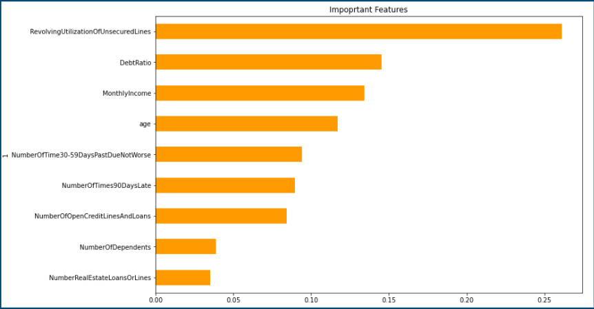
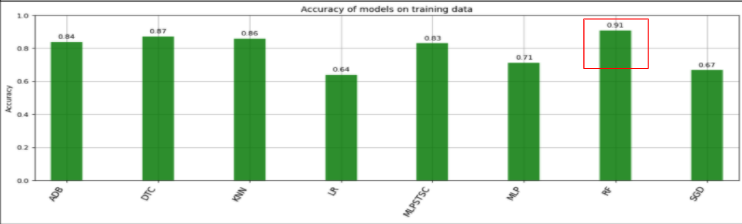
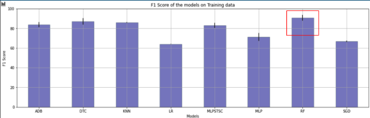

# Seriously Delinquent 

### **Team Members**
- April
- Endalkachew
- Matt
- Ryan

## **Motivation**

Financial institutions receive an overwhelming amount of credit card and loan applications. Going through each request manually is time consuming and prone to human error. With Machine Learning, we can build a model that can aid decision making for lenders and borrowers to predict potential future financial delinquency. 

## **Objectives**
- Identify the dependent vs independent features from the data set
- Build a ML model that can predict whether borrowers will experience financial distress in the next two years
    - Financial distress: experience >90 days past due delinquency
- Identify independent features and sort by importance 
- Build a robo adviser that can automate task based on questions from important features

## **Data Sources**
- [Kaggle](https://www.kaggle.com/c/GiveMeSomeCredit/data)

## **Action Items**
- Data cleaning and shaping (Jupyter Lab and Google Colab)
    - Data preparation using Sklearn libraries:
        - Imputed the data (for NA, NAN, NULL values)
        - Imbalanced data - synthesized the minority class data using SMOTE technique and adaptive synthetic sampling technique on the training data
    - Removed the highly correlated columns
    - Parameter tuning:
        - Applied Grid search cross validation technique to search for model selection and parameter tuning 
- Data analysis using ML models: Random forest, Decision Tree, Linear Regression, AdaBoost, KNN, Multilayer Perception and XGBoost
- Create Amazon Lex IAM users and build framework for bot
- Create API with Heroku
- Presentation

## **Assets Delivered**
- ML model analysis notebook ([credit_check.ipynb](Analysis/credit_check.ipynb))
- Additional ML analysis via [Google Colab](https://colab.research.google.com/drive/1ZANriFDfMgfxqpOxnZMHuMNxAcY48Az8?usp=sharing)
- Lambda function used to build the bot ([DraftLambdaDGenie.ipynb](Robo_Adviser/DraftLambdaDGenie.ipynb))
- Saved data sources and analysis outcomes via CSV [files](Data)
- PowerPoint presentation

## **Findings**

#### **What are the important features?**
- (0.26, 'RevolvingUtilizationOfUnsecuredLines')
- (0.14, 'DebtRatio')
- (0.13, 'MonthlyIncome')
- (0.12, 'age')
- (0.09, 'NumberOfTime30-59DaysPastDueNotWorse')
- (0.09, 'NumberOfTimes90DaysLate')
- (0.08, 'NumberOfOpenCreditLinesAndLoans')
- (0.04, 'NumberOfDependents')
- (0.03, 'NumberRealEstateLoansOrLines')

#### **Which ML model(s) had the best f1 and accuracy results?**

- Based on the grid search result, selected models with f1 and accuracy scores > 80 are Random forest, Decision tree, AdaBoost, KNN, Multilayer perception and XGBoost models
- Tested selected models and evaluated models based on classification report - Weighted f1 avg >= 85 are Random forest, Decision tree, AdaBoost,Multilayer perception and XGBoost models
- Applied ensemble classifiers (stacking, Voting soft and voting hard)
- Run the ensemble models and found Weighted f1 avg of 91 and accuracy of 90.45 using the Voting Hard ensemble classifier
- Selected Voting Hard classifier as the final model

#### **Robo Adviser Sample**